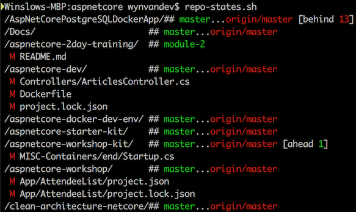

# Script Toolkit

You can add all the scripts in this toolkit to your path by cloning this repo and running `export PATH=$PATH:$(pwd)` or adding it with this path instead of $(pwd) to your ~/bash_profile file.

## Git

`repo-states.sh` - gives the git status of each subdirectory from where you are

### Example Output

